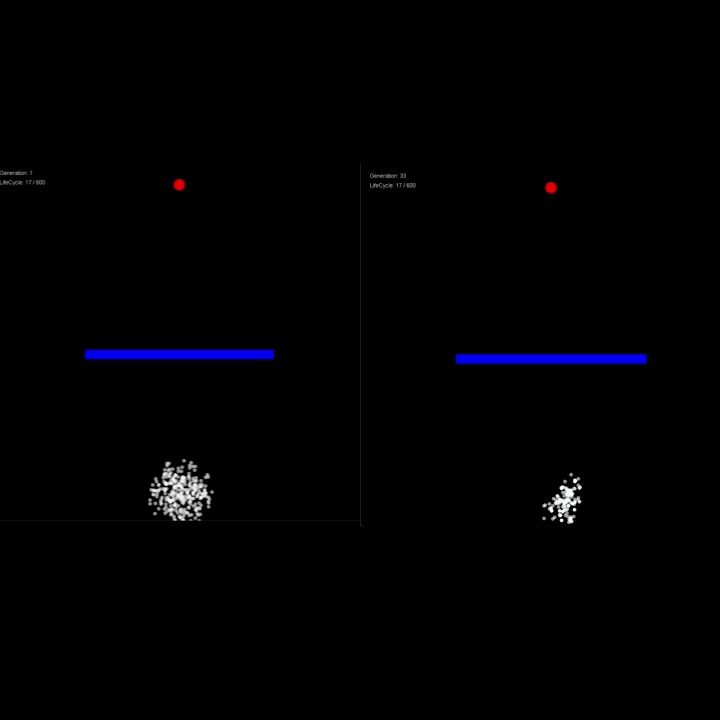

# 🧬 Evolutionary Pathfinding AI (Zero Dependencies)


A smart agent simulation built entirely from scratch in Java, implementing a **Genetic Algorithm** to navigate through obstacles and reach a target. This project uses no external AI/ML libraries, relying strictly on custom physics (`Vector2D`), probability distribution, and object-oriented principles.

## The Simulation in Action



## How the Genetic Algorithm Works

The population evolves over generations without any pre-programmed pathfinding logic (like A\* or Dijkstra). It learns strictly through natural selection:

1. **Initialization (Kaos):** A population of agents is spawned with completely random DNA (an array of random 2D force vectors).
2. **Fitness Function (Sınav):** Each agent's lifespan ends either by hitting a wall or running out of time. They are scored based on their Euclidean distance to the target. Reaching the target multiplies the score; crashing divides it.
3. **Selection (Doğal Seçilim):** A "mating pool" is created. Agents with higher fitness scores get exponentially more tickets in the pool (Probability Distribution).
4. **Crossover & Mutation (Üreme):** Two parents are randomly selected from the pool. Their DNA is spliced together to create a child. A small mutation rate (e.g., 2%) ensures random new vectors are introduced to discover new paths around obstacles.

## ⚙️ Core Architecture & Physics

This is not just an AI project; it includes a custom-built 2D physics engine.

- **`Vector2D.java`**: Handles vector math (addition, scalar multiplication, magnitude, normalization, and speed limits).
- **`Agent.java`**: Applies Newton's Second Law ($F = m \cdot a$). Forces from the DNA dictate acceleration, which alters velocity and updates the position.
- **`DNA.java`**: Represents the agent's brain as an array of vectors.
- **`Population.java`**: Manages the ecosystem, evaluates fitness, and handles the breeding logic.

## 💻 How to Run Locally

Since this project has absolutely zero external dependencies, running it is incredibly simple:

1. Clone the repository:
   ```bash
   git clone [https://github.com/0zan0cak/Evolutionary-Pathfinding-AI.git](https://github.com/0zan0cak/Evolutionary-Pathfinding-AI.git)
   ```
